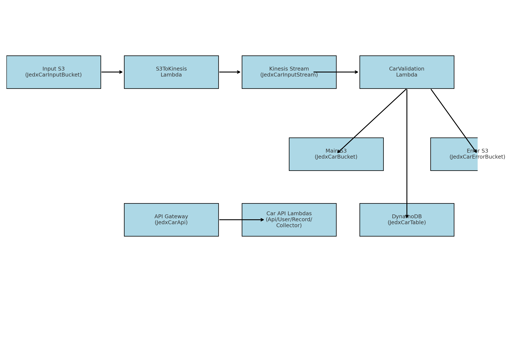

# CAR Service AI-Generated Package

## README

# JEDx CAR SAM Template Documentation

This repository/package contains documentation and supporting artifacts for the **JEDx CAR Service** AWS SAM template.

## Contents

- **template-car.yaml**  
  Original AWS SAM template file.

- **sam_template_doc.yaml**  
  Annotated YAML version of the SAM template with inline comments explaining each section.

- **sam_architecture_diagram.png**  
  Diagram of the system architecture showing data flow:  
  *S3 → Lambda → Kinesis → Validation Lambda → S3/DynamoDB, and API Gateway → Lambda functions.*

- **sam_template_walkthrough.pdf**  
  Plain-English walkthrough of the SAM template describing each resource and how they fit together.

- **README.txt**  
  Plain text version of this guide for offline use.

## Usage

1. Review the annotated YAML (`sam_template_doc.yaml`) to understand how the resources are defined.
2. Use the architecture diagram (`sam_architecture_diagram.png`) for a high-level view of the pipeline and API surface.
3. Refer to the walkthrough (`sam_template_walkthrough.pdf`) for a detailed explanation of each resource.
4. Use the original `template-car.yaml` for deployment with AWS SAM/CloudFormation.

## Notes

- The `COLLECTOR_URL` in the template is currently hard-coded. For better flexibility across environments, replace it with the `CollectorUrl` parameter reference.
- Consider adding retry or DLQ settings for the validation Lambda (`CarValidationFunction`) to avoid silent data loss on transient failures.
- Review IAM policies and narrow them to least-privilege where possible.

---
Generated documentation package for internal use and reference.


## Architecture Diagram



## `sam_template_doc.yaml`

```yaml
<annotated content already in textdoc>
```

## `template-car.yaml`

```yaml
AWSTemplateFormatVersion: '2010-09-09'
Transform: AWS::Serverless-2016-10-31
Description: >
  jedx-collector

  Sample SAM Template for jedx-collector

Globals:
  Function:
    Timeout: 3
    LoggingConfig:
      LogFormat: JSON

Parameters:
  Prefix:
    Type: String
    Default: jedx
    Description: Prefix for all resource names
  CollectorUrl:
    Type: String
    Default: 'https://jys7l8tndd.execute-api.us-east-1.amazonaws.com/Prod'
    Description: The URL for the collector API

Resources:
  ApplicationResourceGroup:
    Type: AWS::ResourceGroups::Group
    Properties:
      Name: !Sub '${Prefix}-car-resource-group'
      ResourceQuery:
        Type: CLOUDFORMATION_STACK_1_0
  ApplicationInsightsMonitoring:
    Type: AWS::ApplicationInsights::Application
    Properties:
      ResourceGroupName: !Sub '${Prefix}-car-resource-group'
      AutoConfigurationEnabled: 'true' 
#
# CAR Service Components
#    The following resources are part of the jedx-car service.
#      
  JedxCarInputBucket:
    Type: AWS::S3::Bucket
    Properties:
      BucketName: !Sub '${Prefix}-car-input-bucket'
      VersioningConfiguration:
        Status: Enabled
  
  JedxCarBucket:
    Type: AWS::S3::Bucket
    Properties:
      BucketName: !Sub '${Prefix}-car-bucket'
      VersioningConfiguration:
        Status: Enabled

  JedxCarErrorBucket:
    Type: AWS::S3::Bucket
    Properties:
      BucketName: !Sub '${Prefix}-car-error-bucket'
      VersioningConfiguration:
        Status: Enabled

  JedxCarInputStream:
    Type: AWS::Kinesis::Stream
    Properties:
      Name: !Sub '${Prefix}-CarInputStream'
      ShardCount: 1

  JedxCarApi:
    Type: AWS::Serverless::Api
    Properties:
      Name: !Sub '${Prefix}-car-api'
      StageName: Prod
      Cors:
        AllowMethods: "'DELETE,GET,HEAD,PUT,POST'"
        AllowHeaders: "'Content-Type,X-Amz-Date,Authorization,X-Api-Key'"
        AllowOrigin: "'*'"
      Auth:
        #DefaultAuthorizer: JedxUserPoolAuthorizer
        Authorizers:
          JedxUserPoolAuthorizer:
            UserPoolArn: arn:aws:cognito-idp:us-east-1:647603630303:userpool/us-east-1_7VKxpkP5l
            Identity:
              Header: Authorization
              ReauthorizeEvery: 0 # Disable reauthorization
  JedxCarApiFunction:
    Type: AWS::Serverless::Function
    Properties:
      FunctionName: !Sub '${Prefix}-car-api-function'
      CodeUri: src/
      Handler: car_api/app.lambda_handler
      Runtime: python3.11
      Architectures:
      - x86_64
      Events:
        JedxCar:
          Type: Api
          Properties:
            RestApiId: !Ref JedxCarApi
            Path: /car
            Method: ANY
      Environment:
        Variables:
          KINESIS_STREAM_NAME: !Ref JedxCarInputStream
          DDB_TABLE_NAME: !Ref JedxCarTable
      Policies:
        - Statement:
            - Effect: Allow
              Action:
                - kinesis:PutRecord
              Resource: !GetAtt JedxCarInputStream.Arn
            - Effect: Allow
              Action:
                - dynamodb:PutItem
                - dynamodb:Query
              Resource: !GetAtt JedxCarTable.Arn

  JedxCarRecordApiFunction:
    Type: AWS::Serverless::Function
    Properties:
      FunctionName: !Sub '${Prefix}-car-record-api-function'
      CodeUri: src/
      Handler: car_api/record.lambda_handler
      Runtime: python3.11
      Architectures:
      - x86_64
      Events:
        JedxCar:
          Type: Api
          Properties:
            RestApiId: !Ref JedxCarApi
            Path: /car/record/{senderId}/{object_type}/{RefId}
            Method: ANY
      Environment:
        Variables:
          S3_CAR_BUCKET: !Ref JedxCarBucket
          DDB_TABLE_NAME: !Ref JedxCarTable
      Policies:
        - Statement:
            - Effect: Allow
              Action:
                - s3:GetObject
                - s3:PutObject
                - s3:GetObjectVersion
                - s3:ListBucket
              Resource: 
                - !Join ['', ['arn:aws:s3:::', !Sub '${Prefix}-car-bucket', '/*']]
            - Effect: Allow
              Action:
                - dynamodb:PutItem
                - dynamodb:UpdateItem
                - dynamodb:GetItem
                - dynamodb:Query
              Resource: !GetAtt JedxCarTable.Arn
  
  JedxCarRecordsApiFunction:
    Type: AWS::Serverless::Function
    Properties:
      FunctionName: !Sub '${Prefix}-car-records-api-function'
      CodeUri: src/
      Handler: car_api/record.lambda_handler
      Runtime: python3.11
      Architectures:
      - x86_64
      Events:
        JedxCar:
          Type: Api
          Properties:
            RestApiId: !Ref JedxCarApi
            Path: /car/records/{senderId}
            Method: ANY
      Environment:
        Variables:
          S3_CAR_BUCKET: !Ref JedxCarBucket
          DDB_TABLE_NAME: !Ref JedxCarTable
      Policies:
        - Statement:
            - Effect: Allow
              Action:
                - s3:GetObject
                - s3:PutObject
                - s3:ListBucket
              Resource: 
                - !Join ['', ['arn:aws:s3:::', !Sub '${Prefix}-car-bucket', '/*']]
            - Effect: Allow
              Action:
                - dynamodb:PutItem
                - dynamodb:UpdateItem
                - dynamodb:GetItem
                - dynamodb:Query
              Resource: !GetAtt JedxCarTable.Arn

  JedxCarCollectorSendApiFunction:
    Type: AWS::Serverless::Function
    Properties:
      FunctionName: !Sub '${Prefix}-car-collector-send-api-function'
      CodeUri: src/
      Handler: car_api/collector.lambda_handler
      Runtime: python3.11
      Architectures:
      - x86_64
      Events:
        JedxCar:
          Type: Api
          Properties:
            RestApiId: !Ref JedxCarApi
            Path: /car/collector/send
            Method: ANY
      Environment:
        Variables:
          S3_CAR_BUCKET: !Ref JedxCarBucket
          DDB_TABLE_NAME: !Ref JedxCarTable
          COLLECTOR_URL: 'https://jys7l8tndd.execute-api.us-east-1.amazonaws.com/Prod'          
          #COLLECTOR_URL: 'https://2l9isbfjdi.execute-api.us-east-1.amazonaws.com/Prod'
          
          #COLLECTOR_URL: !Ref CollectorUrl
      Policies:
        - Statement:
            - Effect: Allow
              Action:
                - s3:GetObject
                - s3:PutObject
                - s3:ListBucket
              Resource: 
                - !Join ['', ['arn:aws:s3:::', !Sub '${Prefix}-car-bucket', '/*']]
            - Effect: Allow
              Action:
                - dynamodb:PutItem
                - dynamodb:UpdateItem
                - dynamodb:GetItem
                - dynamodb:Query
              Resource: !GetAtt JedxCarTable.Arn

  JedxCarUserApiFunction:
    Type: AWS::Serverless::Function
    Properties:
      FunctionName: !Sub '${Prefix}-car-user-api-function'
      CodeUri: src/
      Handler: car_api/user.lambda_handler
      Runtime: python3.11
      Architectures:
      - x86_64
      Events:
        JedxCar:
          Type: Api
          Properties:
            RestApiId: !Ref JedxCarApi
            Path: /car/login
            Method: POST
      Environment:
        Variables:
          DDB_TABLE_NAME: !Ref JedxCarTable
      Policies:
        - Statement:
            - Effect: Allow
              Action:
                - dynamodb:PutItem
                - dynamodb:UpdateItem
                - dynamodb:GetItem
                - dynamodb:Query
              Resource: !GetAtt JedxCarTable.Arn

  S3ToKinesisFunction:
    Type: AWS::Serverless::Function
    Properties:
      FunctionName: !Sub '${Prefix}-car-s3-to-kinesis-function'
      CodeUri: src/
      Handler: s3_to_kinesis_lambda/app.lambda_handler
      Runtime: python3.11
      Architectures:
        - x86_64
      Events:
        S3PutEvent:
          Type: S3
          Properties:
            Bucket: !Ref JedxCarInputBucket
            Events: s3:ObjectCreated:*
      Environment:
        Variables:
          KINESIS_STREAM_NAME: !Ref JedxCarInputStream
      Policies:
        - Statement:
            - Effect: Allow
              Action:
                - kinesis:PutRecord
              Resource: !GetAtt JedxCarInputStream.Arn
            - Effect: Allow
              Action:
                - s3:GetObject
              Resource: 
                - !Join ['', ['arn:aws:s3:::', !Sub '${Prefix}-car-input-bucket', '/*']]
  CarValidationFunction:
    Type: AWS::Serverless::Function
    Properties:
      FunctionName: !Sub '${Prefix}-car-validation-function'
      CodeUri: src/
      Handler: car_validation_lambda/app.lambda_handler
      Runtime: python3.11
      Architectures:
        - x86_64
      EventInvokeConfig: # Configuration for asynchronous invocations
          MaximumRetryAttempts: 0
      Events:
        KinesisEvent:
          Type: Kinesis
          Properties:
            Stream: !GetAtt JedxCarInputStream.Arn
            StartingPosition: LATEST
            BatchSize: 10
      Environment:
        Variables:
          S3_CAR_BUCKET: !Ref JedxCarBucket
          S3_CAR_ERROR_BUCKET: !Ref JedxCarErrorBucket
          DDB_TABLE_NAME: !Ref JedxCarTable
      Policies:
        - Statement:
            - Effect: Allow
              Action:
                - s3:PutObject
              Resource: 
                - !Join ['', ['arn:aws:s3:::', !Ref 'JedxCarBucket', '/*']]
            - Effect: Allow
              Action:
                - s3:PutObject
              Resource: 
                - !Join ['', ['arn:aws:s3:::', !Ref 'JedxCarErrorBucket', '/*']]
            - Effect: Allow
              Action:
                - dynamodb:PutItem
              Resource: !GetAtt JedxCarTable.Arn
  JedxCarTable:
    Type: AWS::DynamoDB::Table
    Properties:
      TableName: !Sub '${Prefix}-car-table'
      AttributeDefinitions:
        - AttributeName: pk
          AttributeType: S
        - AttributeName: sk
          AttributeType: S
      KeySchema:
        - AttributeName: pk
          KeyType: HASH
        - AttributeName: sk
          KeyType: RANGE
      BillingMode: PAY_PER_REQUEST

Outputs:
  JedxCollectorFunction:
    Description: Jedx Car Lambda Function ARN
    Value: !GetAtt JedxCarApiFunction.Arn
  JedxCollectorFunctionIamRole:
    Description: Implicit IAM Role created for Jedx Car function
    Value: !GetAtt JedxCarApiFunctionRole.Arn

```

