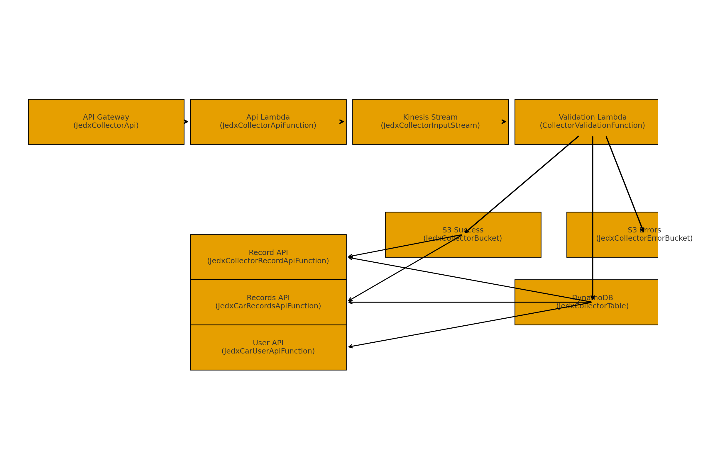

# Collector Service AI-Generated Package

## README

# JEDx Collector – SAM Template Docs

This bundle explains the collector service’s SAM template and data flow.

## Files
- **[template-collector.yaml](#template-collector-yaml)** – original template
- **[template-collector_annotated.yaml](#template-collector-annotated-yaml)** – annotated copy with inline comments
- **[collector_architecture_diagram.png](#collector-architecture-diagram-png)** – high-level diagram
- **[collector_architecture_diagram.pdf](../assets/pdfs/collector_architecture_diagram.pdf)** – printable diagram
- **[collector_template_walkthrough.pdf](../assets/pdfs/collector_template_walkthrough.pdf)** – plain-English walkthrough
- **[collector_template_quickstart.pdf](../assets/pdfs/collector_template_quickstart.pdf)** – one-page quickstart

## Data Flow
Client → API Gateway → **JedxCollectorApiFunction** → **JedxCollectorInputStream (Kinesis)** → **CollectorValidationFunction** → **S3 success/error** + **DynamoDB**.
Record/Records/User endpoints interact with S3 and DynamoDB as appropriate.

## Notes
- Consider DLQ/retry strategy for the Kinesis consumer to handle transient failures.
- Tighten IAM policies to least privilege and scope S3 access to prefixes when possible.


## Architecture Diagram { #collector-architecture-diagram-png }



## collector_architecture_diagram.pdf { #collector-architecture-diagram-pdf }

[Download PDF](../assets/pdfs/collector_architecture_diagram.pdf){ .md-button }

## `template-collector.yaml` { #template-collector-yaml }

```yaml
AWSTemplateFormatVersion: '2010-09-09'
Transform: AWS::Serverless-2016-10-31
Description: >
  jedx-collector

  Sample SAM Template for jedx-collector

Globals:
  Function:
    Timeout: 3
    LoggingConfig:
      LogFormat: JSON

Parameters:
  Prefix:
    Type: String
    Default: jedx
    Description: Prefix for all resource names


Resources:
  ApplicationResourceGroup:
    Type: AWS::ResourceGroups::Group
    Properties:
      Name: !Sub '${Prefix}-collector-resource-group'
      ResourceQuery:
        Type: CLOUDFORMATION_STACK_1_0
  ApplicationInsightsMonitoring:
    Type: AWS::ApplicationInsights::Application
    Properties:
      ResourceGroupName: !Sub '${Prefix}-collector-resource-group'
      AutoConfigurationEnabled: 'true' 


#
# Collector Service Components
#    The following resources are part of the jedx-collector service.
#      
  JedxCollectorBucket:
    Type: AWS::S3::Bucket
    Properties:
      BucketName: !Sub '${Prefix}-collector-bucket'
  JedxCollectorErrorBucket:
    Type: AWS::S3::Bucket
    Properties:
      BucketName: !Sub '${Prefix}-collector-error-bucket'

  JedxCollectorInputStream:
    Type: AWS::Kinesis::Stream
    Properties:
      Name: !Sub '${Prefix}-CollectorInputStream'
      ShardCount: 1

  JedxCollectorApi:
    Type: AWS::Serverless::Api
    Properties:
      Name: !Sub '${Prefix}-collector-api'
      StageName: Prod
      Cors:
        AllowMethods: "'DELETE,GET,HEAD,PUT,POST'"
        AllowHeaders: "'Content-Type,X-Amz-Date,Authorization,X-Api-Key'"
        AllowOrigin: "'*'"
      Auth:
        #DefaultAuthorizer: JedxUserPoolAuthorizer
        Authorizers:
          JedxUserPoolAuthorizer:
            UserPoolArn: arn:aws:cognito-idp:us-east-1:647603630303:userpool/us-east-1_7VKxpkP5l
            Identity:
              Header: Authorization
              ReauthorizeEvery: 0 # Disable reauthorization
  JedxCollectorApiFunction:
    Type: AWS::Serverless::Function
    Properties:
      FunctionName: !Sub '${Prefix}-collector-api-function'
      CodeUri: src/
      Handler: collector_api/app.lambda_handler
      Runtime: python3.11
      Architectures:
      - x86_64
      Events:
        JedxCollector:
          Type: Api
          Properties:
            RestApiId: !Ref JedxCollectorApi
            Path: /collector
            Method: ANY
      Environment:
        Variables:
          KINESIS_STREAM_NAME: !Ref JedxCollectorInputStream
          DDB_TABLE_NAME: !Ref JedxCollectorTable
      Policies:
        - Statement:
            - Effect: Allow
              Action:
                - kinesis:PutRecord
              Resource: !GetAtt JedxCollectorInputStream.Arn
            - Effect: Allow
              Action:
                - dynamodb:PutItem
                - dynamodb:Query
              Resource: !GetAtt JedxCollectorTable.Arn

  JedxCollectorRecordApiFunction:
    Type: AWS::Serverless::Function
    Properties:
      FunctionName: !Sub '${Prefix}-collector-record-api-function'
      CodeUri: src/
      Handler: collector_api/record.lambda_handler
      Runtime: python3.11
      Architectures:
      - x86_64
      Events:
        JedxCollector:
          Type: Api
          Properties:
            RestApiId: !Ref JedxCollectorApi
            Path: /collector/record/{senderId}/{object_type}/{RefId}
            Method: ANY
      Environment:
        Variables:
          S3_COLLECTOR_BUCKET: !Ref JedxCollectorBucket
          DDB_TABLE_NAME: !Ref JedxCollectorTable
      Policies:
        - Statement:
            - Effect: Allow
              Action:
                - s3:GetObject
                - s3:PutObject
                - s3:GetObjectVersion
                - s3:ListBucket
              Resource: 
                - !Join ['', ['arn:aws:s3:::', !Sub '${Prefix}-collector-bucket', '/*']]
            - Effect: Allow
              Action:
                - dynamodb:PutItem
                - dynamodb:UpdateItem
                - dynamodb:GetItem
                - dynamodb:Query
              Resource: !GetAtt JedxCollectorTable.Arn
  JedxCarRecordsApiFunction:
    Type: AWS::Serverless::Function
    Properties:
      FunctionName: !Sub '${Prefix}-collector-records-api-function'
      CodeUri: src/
      Handler: collector_api/record.lambda_handler
      Runtime: python3.11
      Architectures:
      - x86_64
      Events:
        JedxCar:
          Type: Api
          Properties:
            RestApiId: !Ref JedxCollectorApi
            Path: /collector/records/{senderId}
            Method: ANY
      Environment:
        Variables:
          S3_COLLECTOR_BUCKET: !Ref JedxCollectorBucket
          DDB_TABLE_NAME: !Ref JedxCollectorTable
      Policies:
        - Statement:
            - Effect: Allow
              Action:
                - s3:GetObject
                - s3:PutObject
                - s3:ListBucket
              Resource: 
                - !Join ['', ['arn:aws:s3:::', !Sub '${Prefix}-collector-bucket', '/*']]
            - Effect: Allow
              Action:
                - dynamodb:PutItem
                - dynamodb:UpdateItem
                - dynamodb:GetItem
                - dynamodb:Query
              Resource: !GetAtt JedxCollectorTable.Arn
  JedxCarUserApiFunction:
    Type: AWS::Serverless::Function
    Properties:
      FunctionName: !Sub '${Prefix}-collector-user-api-function'
      CodeUri: src/
      Handler: collector_api/user.lambda_handler
      Runtime: python3.11
      Architectures:
      - x86_64
      Events:
        JedxCollector:
          Type: Api
          Properties:
            RestApiId: !Ref JedxCollectorApi
            Path: /collector/login
            Method: POST
      Environment:
        Variables:
          DDB_TABLE_NAME: !Ref JedxCollectorTable
      Policies:
        - Statement:
            - Effect: Allow
              Action:
                - dynamodb:PutItem
                - dynamodb:UpdateItem
                - dynamodb:GetItem
                - dynamodb:Query
              Resource: !GetAtt JedxCollectorTable.Arn
  CollectorValidationFunction:
    Type: AWS::Serverless::Function
    Properties:
      FunctionName: !Sub '${Prefix}-collector-validation-function'
      CodeUri: src/
      Handler: collector_validation_lambda/app.lambda_handler
      Runtime: python3.11
      Architectures:
        - x86_64
      Events:
        KinesisEvent:
          Type: Kinesis
          Properties:
            Stream: !GetAtt JedxCollectorInputStream.Arn
            StartingPosition: LATEST
            BatchSize: 100
      Environment:
        Variables:
          S3_COLLECTOR_BUCKET: !Ref JedxCollectorBucket
          S3_COLLECTOR_ERROR_BUCKET: !Ref JedxCollectorErrorBucket
          DDB_TABLE_NAME: !Ref JedxCollectorTable
      Policies:
        - Statement:
            - Effect: Allow
              Action:
                - s3:PutObject
              Resource: 
                - !Join ['', ['arn:aws:s3:::', !Ref 'JedxCollectorBucket', '/*']]
            - Effect: Allow
              Action:
                - s3:PutObject
              Resource: 
                - !Join ['', ['arn:aws:s3:::', !Ref 'JedxCollectorErrorBucket', '/*']]
            - Effect: Allow
              Action:
                - dynamodb:PutItem
              Resource: !GetAtt JedxCollectorTable.Arn

  JedxCollectorTable:
    Type: AWS::DynamoDB::Table
    Properties:
      TableName: !Sub '${Prefix}-collector-table'
      AttributeDefinitions:
        - AttributeName: pk
          AttributeType: S
        - AttributeName: sk
          AttributeType: S
      KeySchema:
        - AttributeName: pk
          KeyType: HASH
        - AttributeName: sk
          KeyType: RANGE
      BillingMode: PAY_PER_REQUEST

Outputs:
  JedxCollectorFunction:
    Description: Jedx Collector Lambda Function ARN
    Value: !GetAtt JedxCollectorApiFunction.Arn
  JedxCollectorFunctionIamRole:
    Description: Implicit IAM Role created for Jedx Collector function
    Value: !GetAtt JedxCollectorApiFunctionRole.Arn

```

## `template-collector_annotated.yaml` { #template-collector-annotated-yaml }

```yaml
# Annotated SAM Template: jedx-collector
# Purpose: This commented copy explains each section and the unique data flow of the collector service.
#
# Top-level:
# - Transform declares SAM usage; Globals apply default Lambda settings (3s timeout, JSON logs).
# - Parameters.Prefix prefixes all resource names.
#
# Monitoring:
# - ApplicationResourceGroup & ApplicationInsightsMonitoring enable grouping and CloudWatch Application Insights.
#
# Core resources (collector-specific pipeline):
# - JedxCollectorApi (API Gateway + Cognito authorizer) exposes /collector endpoints.
# - JedxCollectorApiFunction receives requests at /collector, writes to Kinesis (KINESIS_STREAM_NAME) and may write to DynamoDB (DDB_TABLE_NAME).
# - JedxCollectorInputStream (Kinesis) buffers events for async validation.
# - CollectorValidationFunction (Kinesis consumer) validates and writes outputs to S3 (success & error) and records to DynamoDB.
# - JedxCollectorRecordApiFunction & JedxCarRecordsApiFunction provide record retrieval via S3/DynamoDB (no Kinesis).
# - JedxCarUserApiFunction handles login-related paths using DynamoDB only.
# - JedxCollectorBucket (success), JedxCollectorErrorBucket (errors) store artifacts; JedxCollectorTable stores metadata/state.
#
# Unique flow vs. CAR service:
# - API first → Kinesis ingestion (instead of S3->Kinesis). The API Lambda publishes directly to the Kinesis stream.
# - Validation then fans out to S3 success/error buckets and writes to DynamoDB.
#

AWSTemplateFormatVersion: '2010-09-09'
Transform: AWS::Serverless-2016-10-31
Description: >
  jedx-collector

  Sample SAM Template for jedx-collector

Globals:
  Function:
    Timeout: 3
    LoggingConfig:
      LogFormat: JSON

Parameters:
  Prefix:
    Type: String
    Default: jedx
    Description: Prefix for all resource names


Resources:
  ApplicationResourceGroup:
    Type: AWS::ResourceGroups::Group
    Properties:
      Name: !Sub '${Prefix}-collector-resource-group'
      ResourceQuery:
        Type: CLOUDFORMATION_STACK_1_0
  ApplicationInsightsMonitoring:
    Type: AWS::ApplicationInsights::Application
    Properties:
      ResourceGroupName: !Sub '${Prefix}-collector-resource-group'
      AutoConfigurationEnabled: 'true' 


#
# Collector Service Components
#    The following resources are part of the jedx-collector service.
#      
  JedxCollectorBucket:
    Type: AWS::S3::Bucket
    Properties:
      BucketName: !Sub '${Prefix}-collector-bucket'
  JedxCollectorErrorBucket:
    Type: AWS::S3::Bucket
    Properties:
      BucketName: !Sub '${Prefix}-collector-error-bucket'

  JedxCollectorInputStream:
    Type: AWS::Kinesis::Stream
    Properties:
      Name: !Sub '${Prefix}-CollectorInputStream'
      ShardCount: 1

  JedxCollectorApi:
    Type: AWS::Serverless::Api
    Properties:
      Name: !Sub '${Prefix}-collector-api'
      StageName: Prod
      Cors:
        AllowMethods: "'DELETE,GET,HEAD,PUT,POST'"
        AllowHeaders: "'Content-Type,X-Amz-Date,Authorization,X-Api-Key'"
        AllowOrigin: "'*'"
      Auth:
        #DefaultAuthorizer: JedxUserPoolAuthorizer
        Authorizers:
          JedxUserPoolAuthorizer:
            UserPoolArn: arn:aws:cognito-idp:us-east-1:647603630303:userpool/us-east-1_7VKxpkP5l
            Identity:
              Header: Authorization
              ReauthorizeEvery: 0 # Disable reauthorization
  JedxCollectorApiFunction:
    Type: AWS::Serverless::Function
    Properties:
      FunctionName: !Sub '${Prefix}-collector-api-function'
      CodeUri: src/
      Handler: collector_api/app.lambda_handler
      Runtime: python3.11
      Architectures:
      - x86_64
      Events:
        JedxCollector:
          Type: Api
          Properties:
            RestApiId: !Ref JedxCollectorApi
            Path: /collector
            Method: ANY
      Environment:
        Variables:
          KINESIS_STREAM_NAME: !Ref JedxCollectorInputStream
          DDB_TABLE_NAME: !Ref JedxCollectorTable
      Policies:
        - Statement:
            - Effect: Allow
              Action:
                - kinesis:PutRecord
              Resource: !GetAtt JedxCollectorInputStream.Arn
            - Effect: Allow
              Action:
                - dynamodb:PutItem
                - dynamodb:Query
              Resource: !GetAtt JedxCollectorTable.Arn

  JedxCollectorRecordApiFunction:
    Type: AWS::Serverless::Function
    Properties:
      FunctionName: !Sub '${Prefix}-collector-record-api-function'
      CodeUri: src/
      Handler: collector_api/record.lambda_handler
      Runtime: python3.11
      Architectures:
      - x86_64
      Events:
        JedxCollector:
          Type: Api
          Properties:
            RestApiId: !Ref JedxCollectorApi
            Path: /collector/record/{senderId}/{object_type}/{RefId}
            Method: ANY
      Environment:
        Variables:
          S3_COLLECTOR_BUCKET: !Ref JedxCollectorBucket
          DDB_TABLE_NAME: !Ref JedxCollectorTable
      Policies:
        - Statement:
            - Effect: Allow
              Action:
                - s3:GetObject
                - s3:PutObject
                - s3:GetObjectVersion
                - s3:ListBucket
              Resource: 
                - !Join ['', ['arn:aws:s3:::', !Sub '${Prefix}-collector-bucket', '/*']]
            - Effect: Allow
              Action:
                - dynamodb:PutItem
                - dynamodb:UpdateItem
                - dynamodb:GetItem
                - dynamodb:Query
              Resource: !GetAtt JedxCollectorTable.Arn
  JedxCarRecordsApiFunction:
    Type: AWS::Serverless::Function
    Properties:
      FunctionName: !Sub '${Prefix}-collector-records-api-function'
      CodeUri: src/
      Handler: collector_api/record.lambda_handler
      Runtime: python3.11
      Architectures:
      - x86_64
      Events:
        JedxCar:
          Type: Api
          Properties:
            RestApiId: !Ref JedxCollectorApi
            Path: /collector/records/{senderId}
            Method: ANY
      Environment:
        Variables:
          S3_COLLECTOR_BUCKET: !Ref JedxCollectorBucket
          DDB_TABLE_NAME: !Ref JedxCollectorTable
      Policies:
        - Statement:
            - Effect: Allow
              Action:
                - s3:GetObject
                - s3:PutObject
                - s3:ListBucket
              Resource: 
                - !Join ['', ['arn:aws:s3:::', !Sub '${Prefix}-collector-bucket', '/*']]
            - Effect: Allow
              Action:
                - dynamodb:PutItem
                - dynamodb:UpdateItem
                - dynamodb:GetItem
                - dynamodb:Query
              Resource: !GetAtt JedxCollectorTable.Arn
  JedxCarUserApiFunction:
    Type: AWS::Serverless::Function
    Properties:
      FunctionName: !Sub '${Prefix}-collector-user-api-function'
      CodeUri: src/
      Handler: collector_api/user.lambda_handler
      Runtime: python3.11
      Architectures:
      - x86_64
      Events:
        JedxCollector:
          Type: Api
          Properties:
            RestApiId: !Ref JedxCollectorApi
            Path: /collector/login
            Method: POST
      Environment:
        Variables:
          DDB_TABLE_NAME: !Ref JedxCollectorTable
      Policies:
        - Statement:
            - Effect: Allow
              Action:
                - dynamodb:PutItem
                - dynamodb:UpdateItem
                - dynamodb:GetItem
                - dynamodb:Query
              Resource: !GetAtt JedxCollectorTable.Arn
  CollectorValidationFunction:
    Type: AWS::Serverless::Function
    Properties:
      FunctionName: !Sub '${Prefix}-collector-validation-function'
      CodeUri: src/
      Handler: collector_validation_lambda/app.lambda_handler
      Runtime: python3.11
      Architectures:
        - x86_64
      Events:
        KinesisEvent:
          Type: Kinesis
          Properties:
            Stream: !GetAtt JedxCollectorInputStream.Arn
            StartingPosition: LATEST
            BatchSize: 100
      Environment:
        Variables:
          S3_COLLECTOR_BUCKET: !Ref JedxCollectorBucket
          S3_COLLECTOR_ERROR_BUCKET: !Ref JedxCollectorErrorBucket
          DDB_TABLE_NAME: !Ref JedxCollectorTable
      Policies:
        - Statement:
            - Effect: Allow
              Action:
                - s3:PutObject
              Resource: 
                - !Join ['', ['arn:aws:s3:::', !Ref 'JedxCollectorBucket', '/*']]
            - Effect: Allow
              Action:
                - s3:PutObject
              Resource: 
                - !Join ['', ['arn:aws:s3:::', !Ref 'JedxCollectorErrorBucket', '/*']]
            - Effect: Allow
              Action:
                - dynamodb:PutItem
              Resource: !GetAtt JedxCollectorTable.Arn

  JedxCollectorTable:
    Type: AWS::DynamoDB::Table
    Properties:
      TableName: !Sub '${Prefix}-collector-table'
      AttributeDefinitions:
        - AttributeName: pk
          AttributeType: S
        - AttributeName: sk
          AttributeType: S
      KeySchema:
        - AttributeName: pk
          KeyType: HASH
        - AttributeName: sk
          KeyType: RANGE
      BillingMode: PAY_PER_REQUEST

Outputs:
  JedxCollectorFunction:
    Description: Jedx Collector Lambda Function ARN
    Value: !GetAtt JedxCollectorApiFunction.Arn
  JedxCollectorFunctionIamRole:
    Description: Implicit IAM Role created for Jedx Collector function
    Value: !GetAtt JedxCollectorApiFunctionRole.Arn

```

