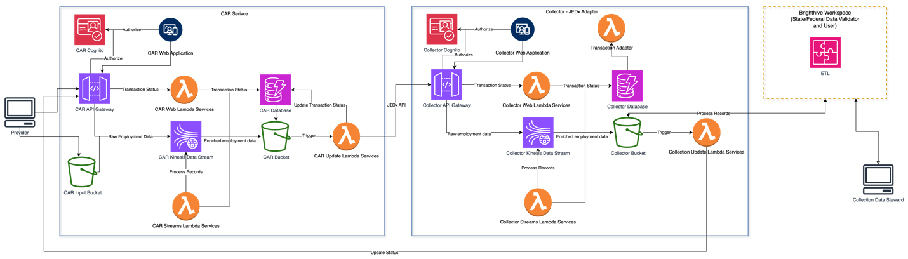
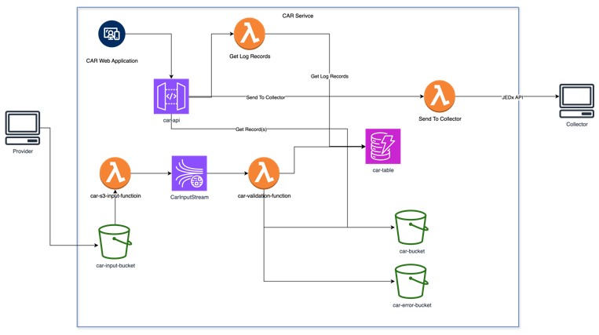
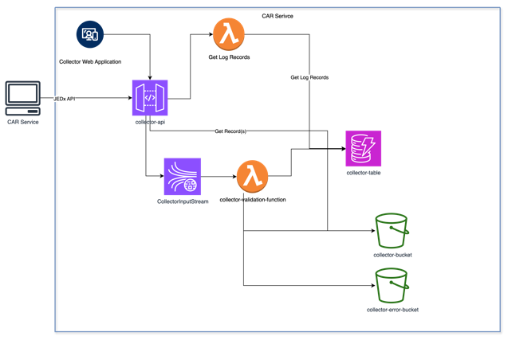

# JEDx AWS Architecture

## Introduction

This document focuses on AWS infrastructure and software components to support the JEDx phase II development.

We will be building a componentized software system that allows users to quickly integrate with the JEDx ecosystem.

This document also refers to two distinct pieces of software: the Provider software also known as the CAR service and the Collector software also known as the JEDx Adapter. The Provider and Collector software communicate and share information, typically in a many (Providers) to one (Collector) arrangement. The Provider software contains a service called CAR (Collection, Aggregation, and Reporting). The collection in this context refers to the collection done by the Provider software system and not to the Collector software.

## Phase II JEDx AWS Infrastructure Overview

The following diagram illustrates the high-level AWS architectural components that are used to support the JEDx Phase II AWS Infrastructure. This document details the architecture to support the Car Service and Collector – JEDx Adapter. The Brighthive Workspace is an external service connected to this architecture through S3 buckets.

------------------------------------------------------------------------

Note: Components to integrate with Brighthive and Collector Update back to CAR Service not implemented as part of Phase II

### Cognito

Amazon Cognito is an identity platform for web applications. It’s a user directory, an authentication server, and an authorization service for OAuth 2.0 access tokens and AWS credentials.  For JEDx, it provides authentication and authorization for the Web Applications and REST API endpoints exposed utilizing the AWS API Gateway service.

### API Gateway

Amazon API Gateway is an AWS service for creating, publishing, maintaining, monitoring, and securing REST, HTTP, and WebSocket APIs at any scale. For JEDx Phase II, the API Gateway is utilized to expose the JEDx REST API to data providers. It is also utilized to expose REST API endpoints to support the JEDx Web Applications.

### Kinesis Data Streams

Amazon Kinesis Data Streams is a massively scalable, durable, and low-cost streaming data service. For JEDx, Kinesis Data Streams are utilized to provide a flexible data pipeline that allows for validation and enhancing the JEDx data as it flows into the CAR and Collector JEDx API services.

The following diagram illustrates a sample data stream to process incoming JEDx employment record. The actual implementation my vary. This streaming framework allows for chaining logic to processing data as it flows through the data stream. Lambda functions are utilized to verify and enhance the data as it flows through the stream to an S3 bucket.

### Lambda

Lamda is a serverless compute service offered AWS that allows users to run code without managing servers. JEDx Phase II utilized Lambda functions for three purposes.

- REST API Gateway Endpoints to support web applications

- REST API Endpoint to support JEDx API

- Data Stream processing steps

### DynamoDB

DynamoDB is AWS’s fully managed NoSQL database. JEDx Phase II utilizes DynamoDB for a transaction log of data processing records.

### S3

Aws Simple Storage Service (S3) is an object storage service provided by AWS. JEDx Phase II utilized S3 to store employment records that are being processed by the systems.

## CAR Service

The following diagram details the components that make up the CAR Service for Phase II.

The car service is a collection of AWS components and code to support the ingestion of JEDx records, validation and the submission to the collector service.

The car service is composed of several AWS resources

- S3 Buckets

  - car-input-bucket - Bucket to receive new records

  - car-bucket - Bucket where process records are stored

  - car-error-bucket - Bucket where records with errors are stored

- Kinesis Streams

  - CarInputStream - Input processing stream

- API Gateway Endpoints

  - car-api - API Gateway for CAR API

- Lambda Functions

  - car-api-function - CAR API Function

  - car-record-api-function - CAR Record API Function

  - car-records-api-function - CAR Records API Function

  - car-collector-send-api-function - CAR Collector Send API Function

  - car-user-api-function - CAR User API Function

  - car-s3-to-kinesis-function - CAR Input Process from S3 bucket to Kinesis Stream

  - car-validation-function - CAR Validation Funcation triggered from Kinesis Stream

- DynamoDB

  - car-table - DynamoDB table for CAR log records

It includes the following code:

- car_api - Code for the application's Lambda functions.

  - app.py - Code to support get and post API calls to create/modify and retrieve log records

  - collector.py - Code to support API call to send records to the collector

  - record.py - Code to support API calls get, update and create CAR record file

  - user.py - Code to support logging into the CAR service

- car_validation_lambda

  - app.py - Code for the car validation function.

- s3_to_kinesis_lambda

  - app.py - Code to take records from s3 bucket and put them on a kinesis stream

- template-car.yaml - A template that defines the application's AWS resources.

### Web-app (Sender) endpoints used by the CAR UI

These endpoints sit behind the CAR API Gateway and Lambda functions listed earlier in this section (e.g., car-api, car-records-api-function, etc.).

**Base URL (prod/dev):**

- **Prod:** VITE_CAR_BASE_URL (front-end env var)

- **Dev:** '/api' via dev proxy (Vite)\
  The UI attaches an Authorization: Bearer \<token\> header from the browser’s auth-store.

| **Method** | **Path** | **Purpose (used by UI)** | **Auth** | **Request body (shape)** | **Response (shape)** | **Notes** |
|----|----|----|----|----|----|----|
| POST | /car/login | Authenticate a sender user and obtain a token for subsequent calls | No | { username, password } | Token/session object | Called by the login screen. |
| GET | /car/records/{senderId} | List all records (Jobs, Workers, Organizations, Worker\*Reports) for a sender | Yes | — | Array of record objects (possibly nested; UI flattens) | Primary “Preview/Objects” source in the Sender UI. |
| GET | /car?senderRefId={senderId} | List log entries for the sender | Yes | — | Array (or object with Items) | Used for the “Logs” views in the Sender UI. |
| POST | /car/record/{senderId}/job/{jobRefId} | Update a Job (e.g., apply SOC code), and optionally append a log | Yes | { record: { job, RefId }, log? } | Operation status / updated object | Sender UI uses this to persist job edits and SOC metadata. Use RefId, not business ID. |
| POST | /car/collector/send | Submit selected objects to the Collector | Yes | { senderId, records: \["{type}#{RefId}", ...\] } | Status string (success message) | Types: job, worker, organization, worker_compensation_report, worker_paid_hours_report. Always RefId. |

#### SOC Autocoder (external service used by the Sender UI)

**Endpoint (external):** POST \${VITE_SOC_AUTOCODER_URL} with { jobs: \[{ id, title, description }\] }.

- **Response handling:** UI accepts multiple possible shapes (e.g., standardOccupationalClassificationCodes, suggestions, socCodes, results), normalizes to { value, description, score }\[\].

- **Apply SOC to a Job:** The Sender UI persists the chosen SOC by updating the Job record in CAR (see POST /car/record/{senderId}/job/{jobRefId} above).

NOTE: These calls go to a *separate* service and are **<u>not</u>** part of CAR/Collector API Gateway.

## Collector Service

The following diagram details the components that make up the Collector Service for Phase II.

The collector service is a collection of AWS components and code to support the ingestion of JEDx records, and validation.

The collector service is composed of several AWS resources

- S3 Buckets

  - collector-bucket - Bucket where process records are stored

  - collector-error-bucket - Bucket where records with errors are stored

- Kinesis Streams

  - CollectorInputStream - Input processing stream

- API Gateway Endpoints

  - collector-api - API Gateway for COLLECTOR API

- Lambda Functions

  - collector-api-function - COLLECTOR API Function

  - collector -record-api-function - COLLECTOR Record API Function

  - collector -records-api-function - COLLECTOR Records API Function

  - collector -user-api-function - COLLECTOR User API Function

  - car-validation-function - COLLECTOR Validation Function triggered from Kinesis Stream

- DynamoDB

  - collector-table - DynamoDB table for COLLECTOR log records

It includes the following code:

- collector_api - Code for the application's Lambda functions.

  - app.py - Code to support get and post API calls to create/modify and retrieve log records

  - record.py - Code to support API calls get, update and create CAR record file

  - user.py - Code to support logging into the CAR service

- collector_validation_lambda

  - app.py - Code for the car validation function.

- template-collector.yaml - A template that defines the application's AWS resources.

### Web-app (Collector/Receiver) endpoints used by the Collector UI

These endpoints sit behind the Collector API Gateway and related Lambdas (e.g., collector-api, collector-records-api-function).

**Base URL (prod/dev):**

- **Prod:** VITE_COLLECTOR_BASE_URL

- **Dev:** '/api' via dev proxy\
  Auth header is the same Authorization: Bearer \<token\>.

| **Method** | **Path** | **Purpose (used by UI)** | **Auth** | **Request body** | **Response** | **Notes** |
|----|----|----|----|----|----|----|
| POST | /collector/login | Authenticate a collector user and obtain a token | No | { username, password } | Token/session object | Mirrors the CAR login for the Receiver role. |
| GET | /collector/records/{senderId} | List objects received for a given sender | Yes | — | Array of objects (if supported) | UI first tries this general endpoint… |
| GET | /collector/records/{senderId}/{ObjectType} | …then falls back to type-specific lists | Yes | — | Array | ObjectType ∈ { Job, Worker, Organization, WorkerPaidHoursReport, WorkerCompReport }. |
| GET | /collector?senderRefId={senderId} | List log entries in Collector | Yes | — | Array (or object with Items, logs, or data) | UI handles multiple shapes and normalizes to an array. |

## Front-end integration notes (applies to both apps)
