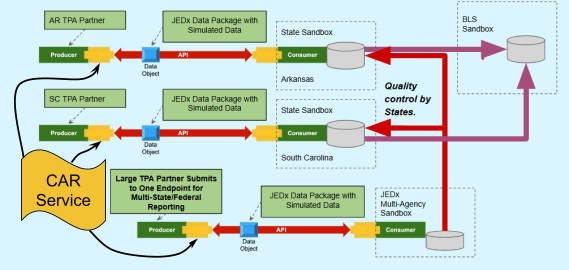
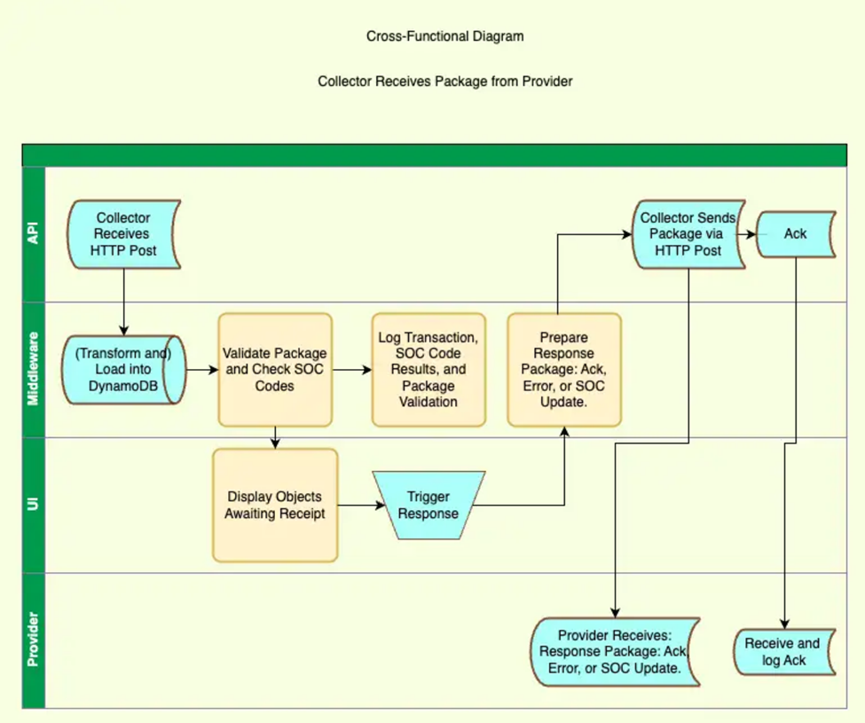
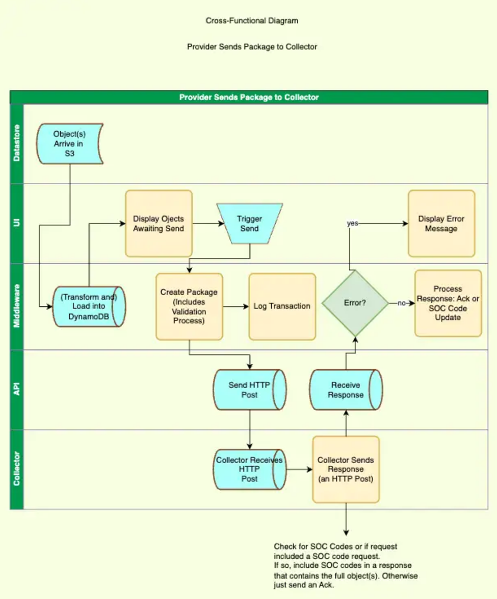
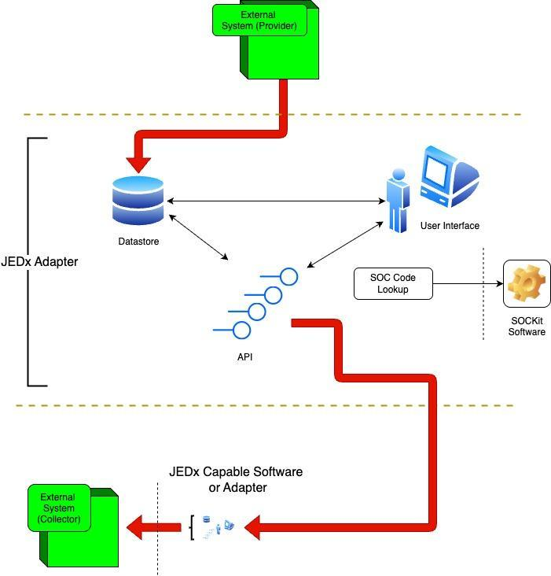
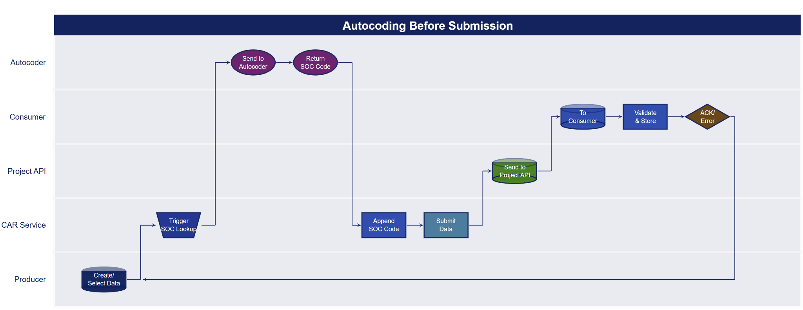
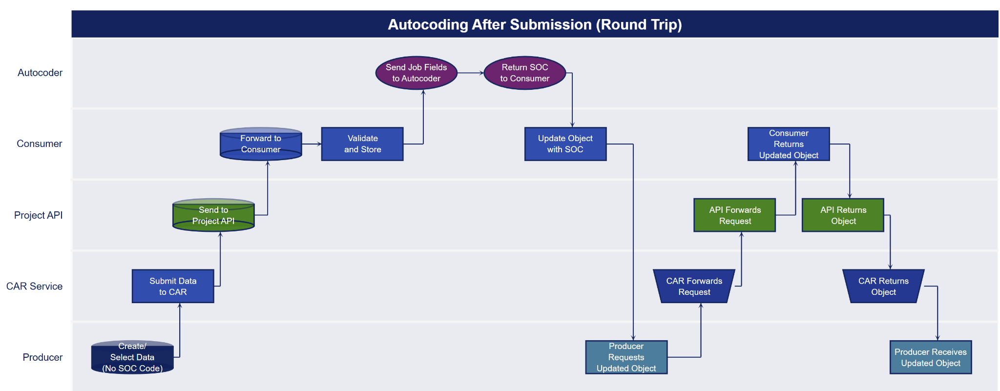

# JEDx Transport

## Introduction

This document focuses on software development. Therefore the JEDx structure and message choreography is left to other documents.

We will be building a componentized software system that allows users to quickly integrate with the JEDx ecosystem. The objectives of this software are described below.

You will notice that this requirements document uses the form of “the software will …” This repetition is intentional. It sets up measurable objectives for each point.

This document also refers to two distinct pieces of software: the Provider software and the Collector software. The Provider and Collector software communicate and share information, typically in a many (Providers) to one (Collector) arrangement. The Provider software contains a service called CAR (Collection, Aggregation, and Reporting). The collection in this context refers to the collection done by the Provider software system and not to the Collector software.

### Phase II JEDx Project Overview

In stage I the JEDx team created one API Test Instance that receives data. The JEDx team simulated sending data to that JEDx test instance manually, simulating what would happen in a Collection, Aggregation, and Reporting service of an employer or third party agent.

In stage II we are simulating sending data to simulated state collector systems (“sandboxes”) via three separate instances of the JEDx Application Programming Interface (API) Architecture. This will implement plans previously developed by pilot partners to show the movement of simulated data from third party agents (TPAs) to JEDx state sandboxes via the JEDx API.

This data flow is shown in Figure 1 below. Each data provider will need a Collection, Aggregation, and Reporting (CAR) service to package and send the simulated data via the JEDx API. The creation of a CAR service may impose a burden on TPAs and integrators that are still exploring their interest in joining the JEDx initiative. To mitigate this burden, this project will create a simulated CAR service that can be used by multiple TPAs to send data via the JEDx API.

Figure 1: JEDx Stage 2 Pilot Data Flow{ width="663" }

> In addition, during the course of the JEDx project up to and including the stage one pilot, the JEDx team recognized the need for additional architectural capabilities to support pilot partners in the implementation of the sandbox instances envisioned for the stage two pilot. For example, the following additional needs emerged through our planning with the partner states and BLS:

- Upstream sandbox for use by the Bureau of Labor Statistics after data is collected and quality checked via state or multistate instances.

- A more modular implementation of the JEDx API that can be deployed separately from the data pipeline. — A reference implementation of the API that is modular and separate from the data pipeline can reduce risks at this stage and in future pilots. It will support easier integration with more kinds of state systems, reducing some of the integration costs as more states adopt JEDx.

- Separation of tier 1 basic validation of collected data (upon receipt via the API) from more complex and custom state-specific validation later in the data pipeline, e.g. checking for valid SOC codes in a job object (to be demonstrated in sandbox instances in the Brighthive platform in the stage 2 test).

Our approach will be to create a separate reference implementation of the API with its own collector data store that can be used by various systems, including but not limited to the Brighthive platform. By not baking the API into the (Brighthive) data pipeline system but as a separate collector system with its own data store, various data management systems can use various interfaces (API, ETL middleware, or other means) to access and update the collector data store.

## Components

The application will consist of at least four components:

1.  **Administrative Interface:** A user interface (UI). This will consist of one or more web pages. The pages will be used to examine logs, view reports, and launch manual processes, if any.

2.  **JEDx API Service:** An API. The API will serve requests from external clients as well as the UI (web pages). This could also be conceptualized as a JEDx service.

3.  **JEDx DataStore:** Datastores. An S3 bucket and a database.

4.  **Middleware:** Will perform services such as data validation and more.

These components will be built as free standing components that can be implemented by anyone wishing to participate in the JEDx ecosystem.

Any connection between a provider’s native data storage or the collector’s native data storage and the JEDx Datastore is the responsibility of the implementer. For example, an ETL or ELT pipeline from an external administrative system to JEDx objects internal to the application.

For the purposes of the JEDx Stage 2 Pilot BSI, QIP, and AEM will work together to support Brighthive’s implementation.

Points one through four above could be together conceptualized as a **JEDx service adapter.**

To illustrate the overall package exchange and SOC code processing, the following two cross-functional diagrams (Figure 2 and Figure 3) show the end-to-end workflows between the Provider and Collector systems.

These diagrams provide a high-level view of how packages move through each major system component, including where validation, transformation, and response handling occur.

Figure 2. Cross-Functional Flow: Provider Sends Package to Collector

{ width="616" }

Figure 3. Cross-Functional Flow: Collector Receives Package from Provider

{ width="582" }

### Technical Approach - Collector

Each instance of the modular JEDx data collector subsystem will work independently, receiving data via the JEDx API, performing basic validation, sending initial acceptance or rejection responses to the data provider, and storing the data objects with metadata about the submission and status of the data objects.

The data pipeline/data management subsystem (planned to be handled by the Brighthive sandboxes in the stage 2 pilot) will be decoupled from initial API and Collector. That data pipeline will be able to access the data objects (e.g. via Airbyte ETL automation middleware) to perform further validation, autocoding, and demonstrated use of the data. Changes to the data, such as adding a SOC code, would need to be posted back to the separate collector data store.

Any change, such as adding SOC codes, made by the data management subsystem would trigger a function that would post those updates back to the data Provider. (In the stage 2 test the data Provider function may be handled by the Simulated CAR Service.)

### JEDx Component and Process Flow Diagram

Figure 4: JEDx Adapter Process Flow - Provider to Collector

{ width="468" }

## Phase II Deliverables

### Technical Deliverables

1.  Redeployable (via AWS SAM) JEDx API Implementation

2.  Redeployable JEDx Object Data Store with Metadata Store (including API response metadata, update flagging, etc. to support round trip data flows)

3.  Redeployable Agent to monitor data changes and post updated objects to the data provider source system via the JEDx API. e.g. If the state adds SOC codes the system would post that update with provenance metadata back to the source.

### JEDx API Service

1.  JEDx API CAR Integration with Collection Data Store. Modular redeployable instance of the JEDx API with Collection Data Store that can collect data in the stage 2 pilots for Arkansas, South Carolina and a multi state instance, including:

    1.  A deployable software package for a modular JEDx data consumer subsystem

    2.  Three separate modular instances of the JEDx API that can be decoupled from the data pipeline of the sandbox Basic validation of the JEDx objects

    3.  Three separate collector data+metadata store instances to hold JEDx data objects received via each API instance

    4.  Ability for the service to return data to the data providers when data or metadata are updated by the connected data management system

    5.  Integration and testing with the Simulated CAR Service

2.  Support for Brighthive in accessing the collector data store using its Airbyte ETL middleware

3.  Support for Brighthive in implementing upstream ETL to the BLS sandbox according to the model developed with pilot partners

### Standard Occupational Code (SOC) Lookup via Web User Interface

*Develop a web interface and back-end integration with the RIPL SOCkit API that demonstrates e-submission lookup and the addition of SOC codes to the CAR Service simulated Job object data. This includes the following tasks:*

1.  **Design and development support:** Design and develop the web interface and back-end integration with QIP assistance.

2.  **Testing:** Test the functionality of the web interface and back-end integration and provide feedback to QIP.

The diagrams below illustrate the two primary workflow options for integrating SOC code lookup into the data submission process. Each workflow details how the autocoding step can occur either before or after data submission, providing visual context for the interface and integration described above.

In both cases, the “Producer” and “Consumer” roles shown in the diagrams represent the **Autocode Producer** (the party submitting data for autocoding) and the **Autocode Consumer** (the party receiving autocoded data). These roles are distinct from the Provider (the system or organization responsible for originating the data) and the Collector (the ultimate recipient or integrator of the submitted data).

**Case 1: Autocoding Before Submission**

- The Autocode Producer initiates the autocoding process before submitting data.

- The CAR Service coordinates with the Autocoder to retrieve the appropriate SOC code(s), appends them to the data, and then submits the complete, coded package.

- The Autocode Consumer then validates, stores, and acknowledges receipt of the coded data.

**Case 2: Autocoding After Submission**

- The Autocode Producer submits the data **without** SOC codes.

- The data passes through validation and is then sent to the Autocoder as part of a post-submission enrichment step.

- The Autocode Consumer updates the data object with the autocoded SOC information and returns the updated object back through the workflow, ensuring the Autocode Producer can retrieve the final, enriched data.

Figure 5: Autocoding Before Submission Workflow

{ width="624" }

Figure 6: Autocoding After Submission (Round Trip) Workflow

{ width="624" }

### JEDx API CAR Integration with Collector Data Store

*In coordination with the larger QIP team, develop a modular redeployable instance of the JEDx API and support its use by Brighthive. This includes the following tasks:*

1.  <u>Modular redeployable API instance:</u> Develop a modular redeployable instance of the JEDx API with Collector Data Store that can collect data in the Stage II pilots for Arkansas, South Carolina, and a multi-state instance, including:

    1.  A deployable software package for a modular JEDx data consumer subsystem.

    2.  Three separate modular instances of the JEDx API that can be decoupled from the data pipeline of the sandbox.

    3.  Basic validation of the JEDx objects.

    4.  Three separate collector data plus metadata store instances to hold JEDx data objects received via each API instance.

    5.  The ability for the service to return data to the data providers when data or metadata are updated by the connected data management system.

    6.  Integration and testing with the Simulated CAR Service

2.  <u>Brighthive support:</u> Assist QIP with providing support to Brighthive

    1.  in accessing the collector data store using its Airbyte ETL middleware.

    2.  in implementing upstream ETL to the BLS sandbox according to the model developed with pilot partners.

## Requirements

- The software will be configurable to send data to multiple collector points. Common collector points will be available in a pick list or similar control.

- The software will expose/utilize REST-style endpoints. It will conform to REST conventions. In addition, the transport mechanism for messages will be as specified in the SIF \[version\] infrastructure document \[link\] also known as the JEDx API

### General Technical Specifications

1.  AWS implementation using the serverless approach.

2.  Emit JEDx objects in JSON Format

3.  Endpoints will be public, but require authentication for use (see the next requirement)

4.  Authorization for endpoints (next phase)

5.  Internal endpoints if needed

6.  Endpoints will emit standard error codes consistent with JEDx infrastructure (basic 200 and 401 for now).

7.  Basic interface for connecting from CAR

8.  JEDx team will specify whether data will be treated as structured, hierarchical (e.g., translated to .xml), or unstructured

9.  SST used to manage and configure AWS, serverless architecture

10. YAML or other appropriate documentation of API

11. Standard occupational code (SOC) lookup via app with user interface

12. Paged output for large messages (this is done with request headers, i.e., the client puts it in the request)

The application will use Amazon Web Services (AWS) to instantiate the software. AWS services used will include, but not limited to:

- One or more S3 buckets

- A database such as DynamoDB or Redshift.

- AWS Lambda

- AWS API Gateway

### Requirements Table

This is an initial pass at requirements. Others will be added during the process of specifying and developing the software. Each item description in the list below can be assumed to be prepended with “the software will …”

| **\#** | **Component** | **Title** | **Description (the software will...)** | **Assigned To** | **Status** |
|----|----|----|----|----|----|
| 2 | Datastore | Sample Data | create sample/synthetic data. people will do this, probably not the software. |  |  |
| 3 | Datastore | Transform and Load Data | transform the data from external format then load into the datastore. This item is a requirement and not just for sample data. |  |  |
| 4 | API | Request SOC codes | request SOC codes for one or more object at the appropriate time |  |  |
| 5 | API | SOC code update | Receive and update SOC codes |  |  |
| 2.1 | UI |  | Front end: Web form UI -- Title & Description |  |  |
| 2.1.1 | UI | Design Web Form | UI Design of web form |  |  |
| 2.1.2 | UI | Build Web Form | Front end web form build -- Connect to SOCKit API to get codes |  |  |
| 2.2 | Datastore | Update Object | Back end: Object update on CAR side |  |  |
| 2.3 | Datastore | Update Object (collector) | Back end: Object update from Collector Side |  | Currently out of scope |
| 3 | API | Object Update | Receive and update previously sent objects |  |  |
| 4 | API | Send Object | send one or more of the JEDx 2.0 RC1 objects to a user selectable destination. The message may contain any number of objects and be of all JEDx types. |  |  |
| 5 | API | Receive Acks and Errors | listen for acknowledgements and error messages. Then trigger an internal message to the UI and log the event in a log file. |  |  |
| 6 | API | Log all events | log all API events both send and receive. the log file layout and design is TBD. |  |  |
| 7 | ETL | Automatic ETL | Automatically load and transform external data |  | Currently out of scope |
| 7a | Datastore | S3 Update Listener | listen for changes in S3 "update bucket" on collector side |  |  |
| 8 | ETL | Manual ETL | Load and transform external data using manual triggers or scripts |  |  |
| 9 | Datastore | JSON input and output to datastore | store and retrieve objects in native json format. text format with a json schema |  |  |
| 10 | Datastore | Create ability | create objects in the datastore |  |  |
| 11 | Datastore | Edit ability | edit objects in the datastore |  |  |
| 12 | Datastore | Read ability | read objects in the datastore |  |  |
| 13 | Datastore | Update ability | update objects in the datastore |  |  |
| 14 | UI | Welcome Screen | present a welcome screen with locale picker, i.e. the target for the message(s). This should be a sticky field. |  |  |
| 15 | UI | Log Files | present a screen with a log file summary. |  |  |
| 16 | UI | Message Report | generate a report summarizing successful and unsuccessful message sends. |  |  |
| 17 | UI | Launch Screen | present a screen that allows users to trigger various events, such as send a single object and multiple objects; as well as display error messages and other responses from a message send. |  |  |
| 18 | Documentation | User’s Guide | provide a short guide to links in the GitHub and a How to guide to install and implement the service. |  |  |

## Appendices

### Appendix A: Glossary of Terms

**BLS** - Bureau of Labor Statistics

**CAR Service, CARS** - Collection, Aggregation, and Reporting Service

**Collector Software** - External System Data Consumer + JEDx Adapter

**External System Data Consumer** - The system, probably more general than JEDx in scope, that collects the data that has been reported.

**External System Data Source** - The system, probably more general than JEDx in scope, that provides the data to be reported.

**JEDx** - Jobs and Employment Data Exchange. A public-private approach for collecting and using standards-based jobs and employment data.

**JEDx Service Adapter** - a component that handles JEDx schema validation, provision of endpoints, communication with other endpoints, reporting, launching processes, and more. The JEDx Adapter is a reference implementation but will be deployable.

**JEDx System** - The combined Provider and Collector Software instances.

**Provider Software** - External System Data Source + JEDx Adapter

**SOC Code** - Standard Occupational Classification codes. A system used by the US government to categorize occupations for various purposes, including data collection and analysis.

**TPA** - Third Party Agent

**Workspace** - Operationally, a US-state-based aspect of the Collector software that makes each state opaque to the others but runs in the same process space. All data will be physically separate. Also referred to as a sandbox.

------------------------------------------------------------------------
